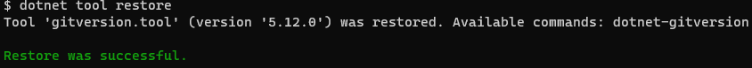
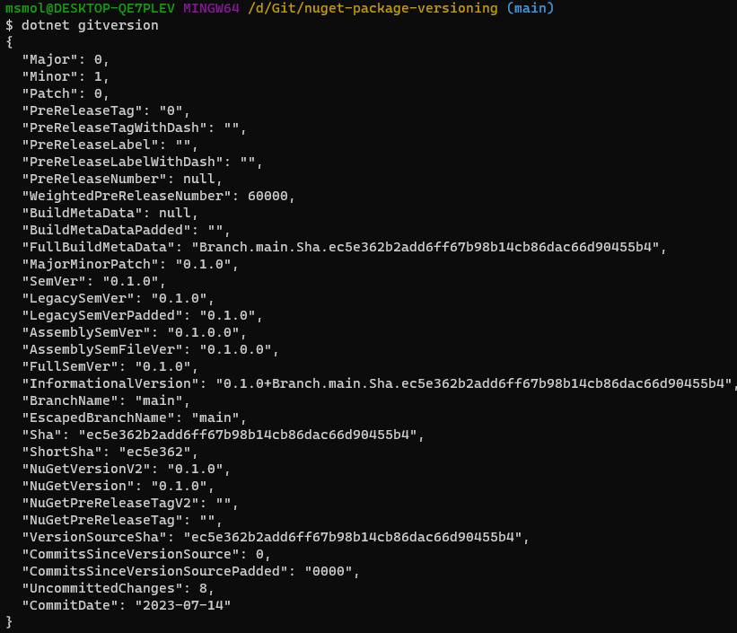

[](https://www.nuget.org/packages/Smola.NuGet.Versioning/)
[](https://github.com/YourGithubUsername/YourRepositoryName/blob/main/LICENSE)
[](https://www.linkedin.com/in/msmolcic/)
[](https://twitter.com/MarioSmolcic)


# 🚀 NuGet Package Versioning 🚀
Welcome! The idea behind this repository is to showcase an efficient and streamlined workflow for NuGet package versioning and publishing. To do so, we'll utilize the power of [GitVersion](https://gitversion.net/docs/learn/how-it-works). The goal? To calculate the current package version, publish pre-release versions, and ultimately streamline testing within your actual project before you decide to merge your changes and release it as part of your next official version.

## 🚄 Flow unpacked 🚄
Crack open the `GitVersion.yml` to reveal the core of our operations. Here, you'll find the main branch has been set as the key source for the mainline strategy. You can read more details about it [here](https://gitversion.net/docs/reference/modes/mainline).

Your feature or hotfix branch getting merged into the main branch signals the new package launch! The patch version gets bumped by default and a new official release gets published to the public NuGet repository. Branching out from the main branch triggers another bump in the patch version - your branch is now considered a release candidate for the new version that will emerge post-merge.

Each commit to your feature branch nudges up the padded version, offering the flexibility to push multiple release candidate versions. This feature comes handy in case you spot something amiss with your library code while testing its integration within one of your services.

However, you can always manually bump the version by either tagging your commit or through your commit message. Take a look at it [here](https://gitversion.net/docs/reference/version-increments).

## 🕵️‍♂️ Peek at the version locally 🕵️‍♂️
Want to check what you're dealing with locally? Step right into the repository root on your machine and type `dotnet tool restore` into your command line. This will make use of the `dotnet-tools.json` definition from the `.config` directory and restore the dependencies you need to hit the ground running. For now, we're dealing only with the `gitversion` tool.



Next, punch in `dotnet gitversion`, and you should see something that looks like this:



## 📦 Decorating Your NuGet Packages 📦
For each of your packages, you'll want to add some context, including description, author, tags, etc. It is as simple as tweaking the `.csproj` file of your project. For our dummy package, the wrapping looks like this:

```
<PropertyGroup>
  <PackageId>Smola.NuGet.Versioning</PackageId>
  <Title>NuGet Versioning</Title>
  <Description>Sample flow for NuGet package versioning.</Description>
  <Authors>Mario Smolcic</Authors>
  <Copyright>Copyright $([System.DateTime]::Now.Year) Mario Smolcic</Copyright>
  <RepositoryUrl>https://github.com/msmolcic/nuget-package-versioning</RepositoryUrl>
  <PackageTags>nuget-versioning mario-smolcic</PackageTags>
</PropertyGroup>
```

Make sure to tailor the metadata of NuGet packages of your libraries accordingly.

## 🤖 Automating the flow with GitHub Actions 🤖
This repository utilizes GitHub Actions to automate the .NET build, pack, and publish process. As a result, every time you push a commit to any branch, a new workflow is triggered.

This is made possible with a defined workflow in `.github/workflows/main.yml.` The workflow is designed to:

* <b>Set up the .NET environment</b> - Prepares the .NET environment using the version specified in the workflow file.
* <b>Restore dependencies</b> - Recovers any dependencies needed for the project.
* <b>Build</b> - Compiles the application and dependencies into a set of binaries.
* <b>Test</b> - Tests will run only if they are defined in the project. I added a dummy test case here to show how it works.
* <b>Pack</b> - Creates a NuGet package from the build result.
* <b>Publish</b> - Pushes the created NuGet package to a public NuGet artifactory.

For the action to successfully publish the package, it needs a [NuGet API key](https://www.nuget.org/account/apikeys) which requires you to register an account for [nuget.org](https://www.nuget.org/) first. Once you've done that, you can provide it in your flow securely using GitHub repository secrets.

You're now ready to version and publish NuGet packages of your own. Happy coding! 🚀